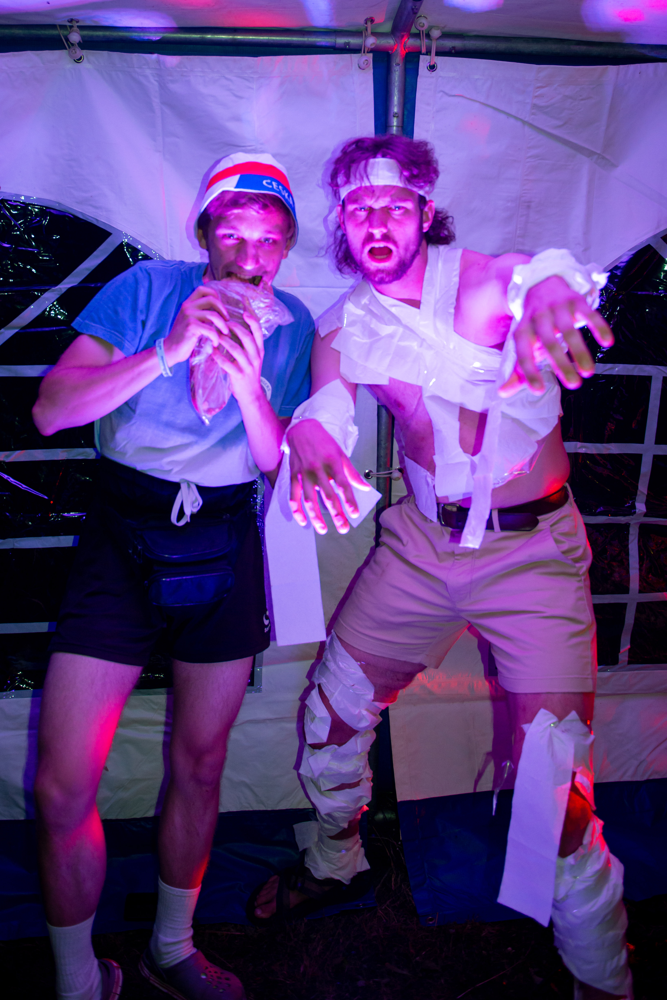
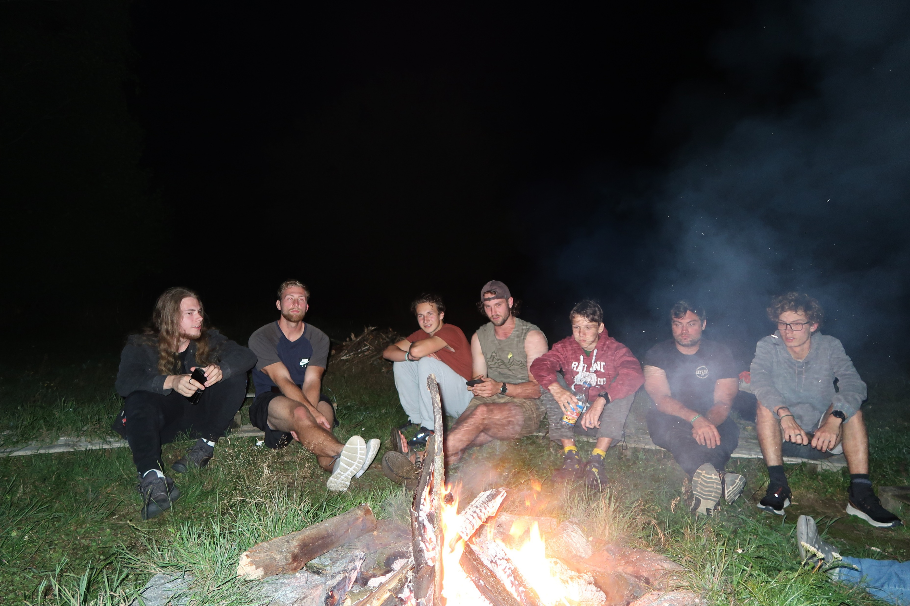
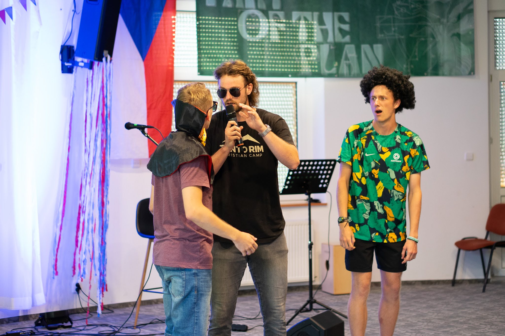
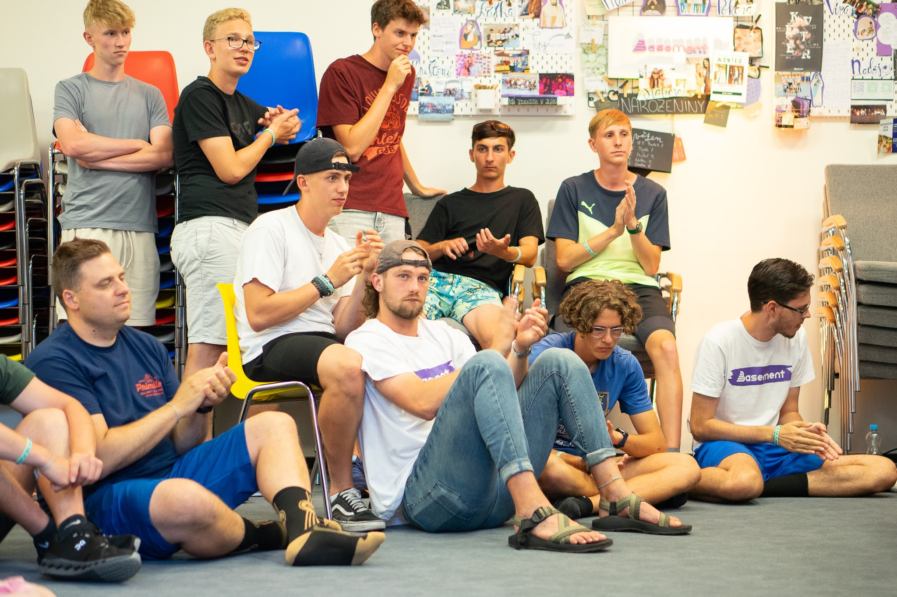
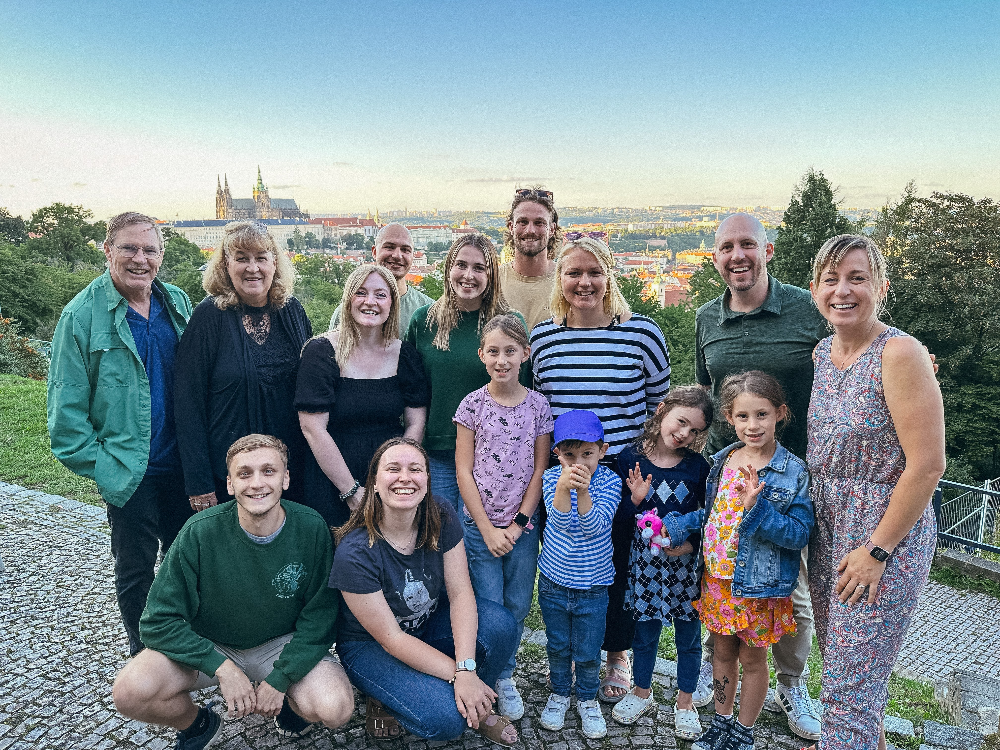
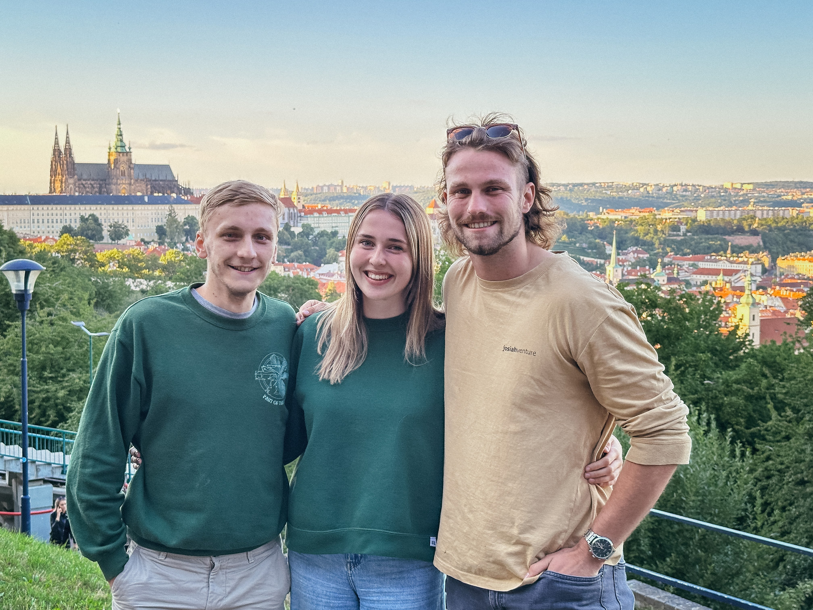

### An Announcement!

As I stated on my previous post, I hosted a Zoom call on Saturday, September 2, 2023 at **7AM Pacific Standard Time**. This was an opportunity to hear it from me about what the summer was like. In this call I gave a short presentation, followed by a Q&A. 

Do not feel badly if you missed it! You can always watch the meeting by clicking [here](https://nam02.safelinks.protection.outlook.com/?url=https%3A%2F%2Fbaylor.zoom.us%2Frec%2Fshare%2Ff0lrZBWY7PbH2_pjE2DRy9AsnBBHLenAj_ACV5IoY2QnJ5sFKD62IGlErynnrfJx.kj2gq4Mb49saZLGh&data=05%7C01%7Ccarson_slater1%40baylor.edu%7C83f11910f7f448fbd36508dbabcfa193%7C22d2fb35256a459bbcf4dc23d42dc0a4%7C0%7C0%7C638292680478685543%7CUnknown%7CTWFpbGZsb3d8eyJWIjoiMC4wLjAwMDAiLCJQIjoiV2luMzIiLCJBTiI6Ik1haWwiLCJXVCI6Mn0%3D%7C3000%7C%7C%7C&sdata=XDhsiqgjCQcSuulqm19YjeF2gQzh%2Fe%2BwR%2FqwuBUpHzg%3D&reserved=0), and input the recording access password **6%j##jls**. If you are interested in watching, I would advise you to skip to **04:18:04**, as we had some people accidentally join the call too early, starting the recording with that.

  

  

### Ten Things I Learned/Was Affirmed in This Summer

After spending a significant amount of time processing the summer, trying to recall all of the events, interactions, and encouraging things, I have concisely narrowed down ten things that God has made apparent to me in my time serving Him. Here they are with brief descriptions:

### 1. God is definitely moving in Central and Eastern Europe. (and all over the world)

One of the tricky parts of doing an internship like mine is actually the post-internship reintegration. I have so many experiences that I have borne witness to God's movement, yet I don't want to compartmentalize God's movement to only Central and Eastern Europe. I'd be lying if I told you that I did not want to go back to the Czech Republic as soon as possible though.

### 2. God has an overarching plan for the restoration of His people that is much bigger than our individual lives. This plan is very much happening inevitably. We are invited to co-labor in this magnificent plan.

Coming into the summer, I had just taken a class on Biblical Theology at my church, and was mindful of the redemptive arc of Scripture. Then when I realized that the camps theme for the summer was `Part of the Plan,' I knew this was totally God's way of reminding me that this redemptive arc is clearly also seen in missions.

  

  

### 3. To be a good steward of kingdom building opportunities, we as Christians ought to do youth ministry and discipleship in our communities. This summer, I discovered the immense value of youth discipleship.

This is intuitive for me, but at the same time, I confess I sometimes saw youth ministry as something `second rate.' Rather, discipling the next generation is one of the most important callings of the church, and should be taken very seriously.

### 4. In many scenarios in our lives, but particularly ministry, we are better off abiding than striving. Also, abiding not a necessarily a passive but rather an active posture (it takes intentionality).

The amount of times I found myself trying to force a gospel conversation, and `coming up short' only for the conversation to happen organically a few days later was uncanny. Trying to white-knuckle and force things is not what bear fruit. In ministry, we follow God's lead, not visa versa.

### 5. I need to learn to be a better steward of my personal bandwidth when it comes to large social environments.

Youth ministry is high energy, and high demand! Young people are vibrant, energetic, and becoming who they are. They have tons of inquiries, anxieties and lots of zeal! I myself am not excluded from this, as I am still young, but there were still points this summer where I felt like I met my maximum bandwidth.

  

  

### 6. I am still broken and need healing from the Lord.

I need the gospel just as much as every student I encounter does! Enough said.

### 7. Being ‘relevant’ is not what bears fruit. Being loving is what we are called to do.

This takeaway is inspired by my pre-internship reading of Nouwen's *In the Name of Jesus*. A theme in the book was Nouwen's honest internal struggle of being `relevant.' Ultimately, I saw this play out in real time this summer. I am not making disciples of myself. I am making disciples of Christ by loving people well.

### 8. We are never told to cast seeds on exclusively the ‘good soil’ we are told to sow seeds, and that is all. To believe we know the heart of others well enough to determine what kind of soil they are is arrogant and incorrect.

If I presuppose that success is found in `winning' people over to Jesus, then I am entirely wrong. There is a biblical basis for this. My calling as a Christian is to faithfully witness that Jesus is Lord, Savior, and friend. My faithfulness is my success. The yield that is borne because of seed I planted is something I have no control over. Hence, I am told to simply be faithful, not exclusively target the people who I think will be receptive to the gospel.

### 9. Every day I do well to ask the question, ‘how can I live on mission today?’

  

  

### 10. The gates of hell will **NEVER** prevail against the church of Christ.

I was so encouraged by the amount of faithful believers I met in the Czech Republic, and I am convinced with full confidence that God is able to uphold His promise to support His bride, the church. We are all United with Christ, and in Christ we have the Holy Spirit and His power in us. No force of evil can stand against that!

  

  

### Want to Stay Involved? Here's How.

1. The first would be to pray! One of Josiah Venture’s core values is bold faith. I want to invite you in bold faith to pray over the ministries that happen all year-round in the Czech Republic through Josiah Venture. For up-to-date prayer requests, you can download the Josiah Venture prayer room app on your phone where you can be guided through praying over specific people and ministries all over Europe. Likewise, if you would like requests pertaining to only the people I worked with, please reach out to me at +1 (480) 320-8898 via text! These people do appear in the prayer room app, but alongside missionaries from other countries.
2. The second way would be giving! If you are interested in giving, please text me and I can share with you some missionaries that I worked with this summer who are in need of more support (there are a few!)
3. The third way you can be involved is by going! If you are interested in going, I can place you in contact with a person who would be able to help you organize a trip next summer to volunteer at an English camp in the Czech Republic!
4. Lastly, the fourth is to pray that I can go back soon. I was hoping to go back next summer, but the nature of my graduate program looks like it will prohibit me from going. Please pray that the Lord opens a door for me to go!

  

  

### The Future of This Blog

This blog was created for the purpose of sharing what God is doing in my life and in the Czech Republic, but I am now no longer in Europe for the foreseeable future. What's next?

Tentative plans for this blog are to post less-frequently, but with thoughts about different topics I am thinking about. It might feel more academic than anything else, though I promise not to write about statistics here too extensively! If you are interested in following along still, feel free to fill out the [email me](mailto:carsonslater_1@baylor.edu), with your name, and indicated interest for the continued email updates anytime I post.

\
χάριτος καἰ εἰρήνη,\
(grace and peace)\
\
`- Carson`

