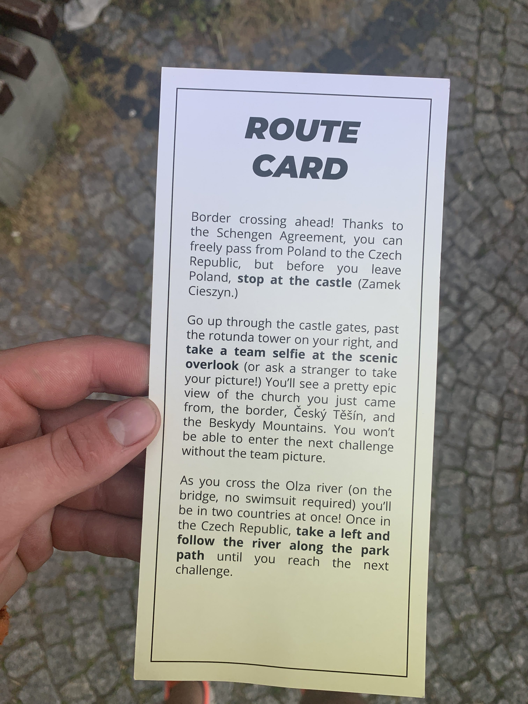
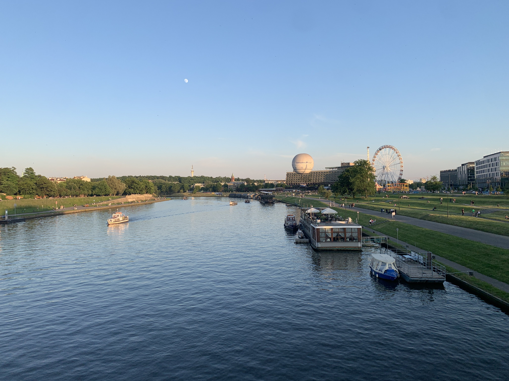
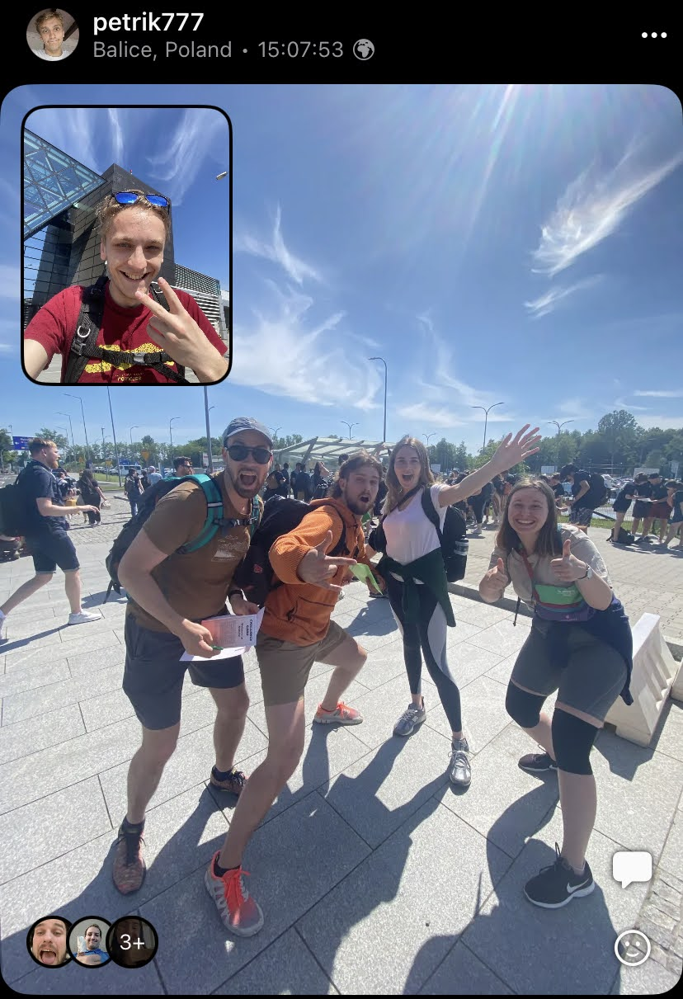
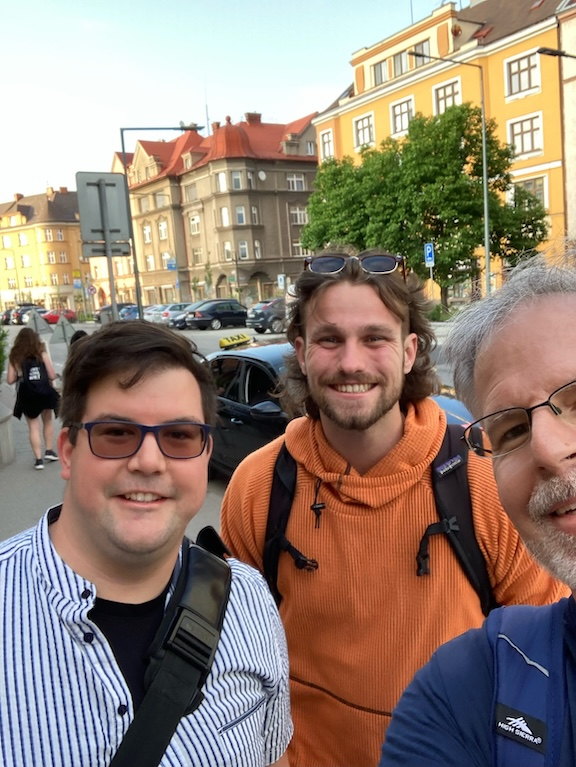
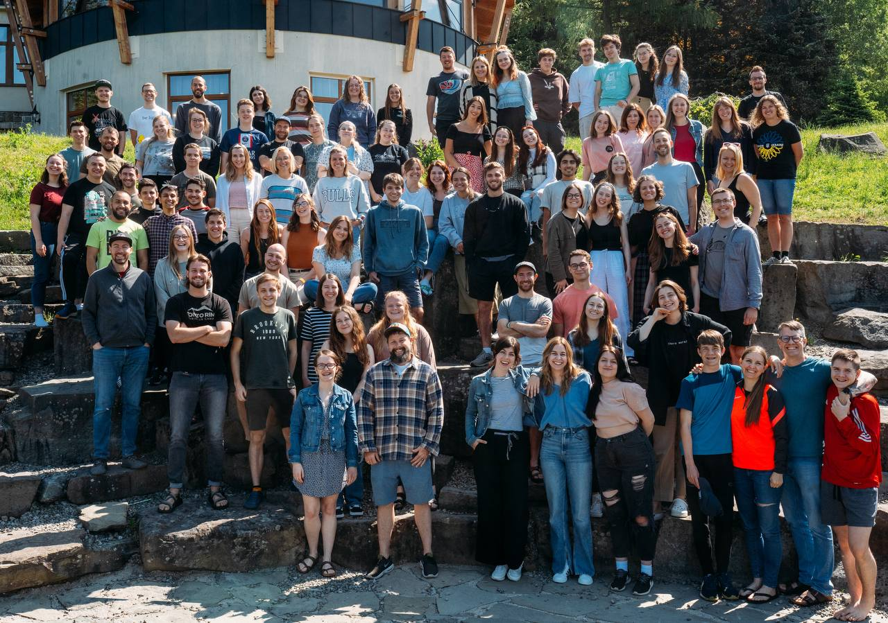

### Ready, Set, Go!

I arrived at the airport in Krakow, Poland with one of my fellow interns, Petr, a JV Czech staff member, Baru, and my intern director, Josh, via bus on Thursday, June 1st. There we met up with our final team member Lydia who flew in from northern Ireland! From there, we started on the [JV Amazing Race](https://www.youtube.com/watch?v=H2edwpFxpg8), which took us throughout the city of Krakow. We encountered challenges that were designed to build up team chemistry, uncover strengths and weaknesses of individuals, and teach us about Josiah Venture and Polish culture. After spending the night in a Krakow hostel and running through some obstacles Friday in Krakow, we took a bus to Český Těšín, where we finished the race (I felt like I had home court advantage low key). 

In case you were wondering, we were in eighth place out of fourteen after day 1, and finished in fifth!

  

  

  

Some noteworthy race features were:
- Finding specific plants in [The Botanical Garden of the Jagiellonian University](https://ogrod.uj.edu.pl/english),
- Riding the [Krakow Eye](http://cracoweye.pl/en/home-english/),
- Puzzles regarding famous Polish music composer's Chopin's [Nocturne No.20 in C sharp minor](https://open.spotify.com/track/2MSgFefjK0T7Iwjvr3OKqV?si=c69a8da111be40c5),
- An epic scavenger hunt all over Krakow, with many items requiring us to talk to strangers,
- Taking a picture from the overlook at Těšín,
- Learning how to wash clothes in a sink in Český Těšín,
- Learning the camp dance,
- and more!

Overall this race was an opportunity for me to gel with my intern team, and I am so thankful for the memorable experience. Running and debriefing it was a huge opportunity to set ourselves up for success over the summer.

After the race, I 'ran into' one of the elders from my Arizona church, Doug Sandy! That was super cool. Doug was the leader of my first trip to Czechia last summer, and he was visiting the church we did our camp with last summer as a short-term team. 

### Intern Training

After the race we traveled to Josiah Venture's retreat center where we began intern training! 

I'd be dishonest if I said that intern training was a breeze. There were many challenges that presented themselves that were opportunities to rely on the Lord. While learning about various topics like the gospel in Europe, team dynamics, culture, healthy conflict resolution, and intern expectations, God was preparing me emotionally to lean on Him this whole summer. Praise God for His subtle (or not so subtle) ways of reminding us of Christ's supremacy!

I saw God moving in the hearts of the interns around me too. There were so many fruitful discussions where other interns were able to share their excitements and concerns about the summer ahead of them in their respective countries. I made a few more friends too at intern training, some of whom I will be praying for throughout the whole summer!

### How am I feeling heading into ministry?

As a perfectionist, I know I will never be 'ready' in the sense that I feel most secure; however, I was itching to engage youth and students by the end of intern training. I am so excited for the coming weeks as I prepare for camps, visit schools to promote camps, and encourage local long-term missionaries! I pray that God may go prepare the way for us as our camps teams prepare.

>"The gospel also reminds me that my righteous standing with God always holds firm regardless of my performance, because my standing is based solely on the work of Jesus and not mine. On my worst days of sin and failure, the gospel encourages me with God’s unrelenting grace toward me. On my best days of victory and usefulness, the gospel keeps me relating to God solely on the basis of Jesus’ righteousness and not mine.[^1]"

### Prayer Requests

I'd love if you joined us in our ministry by praying over us! Some things that we would love you to join us in petitioning the Lord for are:
- That the Lord may bring more students to English camps through our school visits.
- That our team may continue to gel together and build up one another.
- That our local churches with whom we are partnering can prepare for English camps well.
- For the American mission teams that are coming to our English camps.
- For students to have an open heart toward the gospel.
- That we as interns may be effective in meeting students where they are at, to love on them.

### Thank You!

If you are reading this, I want to THANK YOU!!! Your support and prayer means so much to me! Let me know if there are any ways I can be praying for you via tha contact form on the home page!

\
χάριτος καἰ εἰρήνη,\
(grace and peace)\
\
`- Carson`

[^1]: Milton Vincent, *A Gospel Primer for Christians*, p. 21-22.