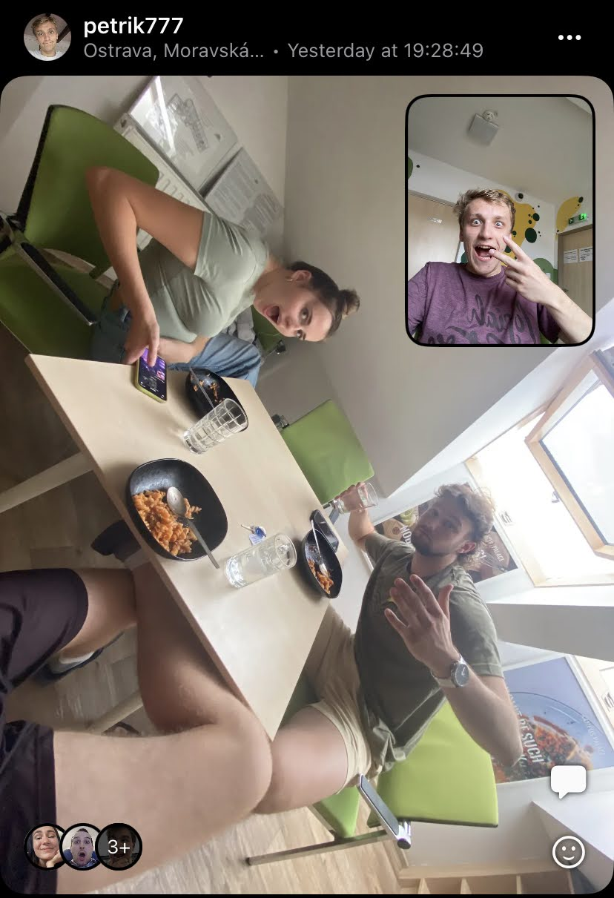
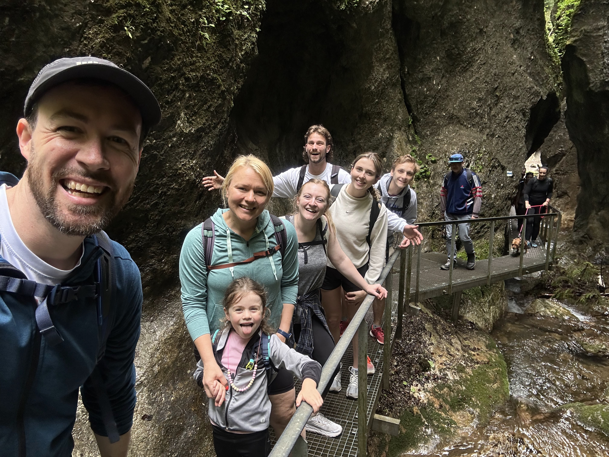
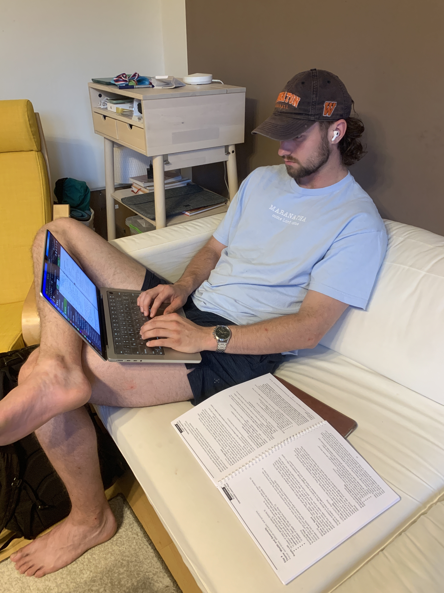

### Please Pray for Ukraine 🇺🇦

Howdy everyone! I know I am doing ministry in Czechia this summer, but I wanted to ask you to please pray for Ukraine as a nation right now. There is a lot of distress, damage and ministry going on there right now! Men from 18-50 are being drafted every day to fight in the war, and we would do well as Christians to pray for them as they experience oppression. Pray that the Russians would relent from their agenda, and for the people in Russia as well!

### Life in Ostrava

For the next month, my home base has become a dormitory in Ostrava, the third biggest city in the Czech Republic. Lots of the JV missionaries live in Ostrava but do ministry all over the surrounding region of Moravia and Silesia. We, as interns are no exception. This week has been nice to get our feet underneath us, but we have been doing lots of preparation for camp. Lots of my free time has been devoted to prepping English class materials for all three levels (Beginner, Intermediate, and Advanced). Other time has been spent brainstorming ice-breaker games, crafting devotionals, and doing intern team-building exercises. We even had a CliftonStrengths Strengthfinders consulting session with a certified coach, who happens to be my intern director's wife!

### School Visits!

On Friday, we traveled to Český Těšín, where we taught six forty-five minute class periods of English basics in the public school. We led games and also promoted camp with flyers, and I even got to share a presentation of where I am from - Arizona! The students were particularly interested in the pictures I had of the desert landscape, because it is so different than the landscape here.

### Rest Day

Saturday was our rest day, where we took a team trip to the mountains of Slovakia! There we hiked through beautiful ravines, and rock crevices. It was green and a very refreshing time with the team (literally - it rained!).

### More Preparation

This upcoming week we are hitting the road to promote camp on the other side of the country. Our third camp this summer is being hosted by two churches working together in the Prague area, and it will be the first year they have ever done an English Camp! As a result, we will be much more hands-on with this English Camp and have to walk the church through what doing one of these camps look like. They have smaller youth groups, but we are hoping the school visits in their areas on Wednesday, Thursday, and Friday will get students in their communities excited about English Camp. So, Tuesday is another administrative day (prepping for teaching English does take many hours) where we will be gearing up for English classes and the upcoming school visits. 

I will also be preparing for Mission Team Training, where we will train the short-term American teams that are coming to support these English Camps. For these trainings, we can share how these short-term teams can be the most effective in the camps ministry while still being good stewards of their own bandwidth.

### Prayer Requests

I'd love if you joined us in our ministry by praying over us! Some things that we would love you to join us in petitioning the Lord for are:
- That the Lord may bring more students to English camps through our school visits.
- There are many logistical things that are still unresolved about our summer. Pray that God would help us steward our time here well.
- Pray that God will show us a faster and more effective way to prepare for English classes.
- Thanking God that our team is really growing closer together and more comfortable with each other.
- Pray that our local churches with whom we are partnering can prepare for English camps well. Especially the churches near Prague!
- Pray for the American mission teams that are coming to our English camps.
- Pray for students to have an open heart toward the gospel.

### With All the Gratitude I Can Muster

> "O kingdoms of the earth, sing to God; sing praises to the Lord, Selah" [^1]

If you are reading this, I want to THANK YOU!!! Your support and prayer means so much to me! Let me know if there are any ways I can be praying for you via tha contact form on the home page!

\
χάριτος καἰ εἰρήνη,\
(grace and peace)\
\
`- Carson`

[^1]: Psalm 68:32