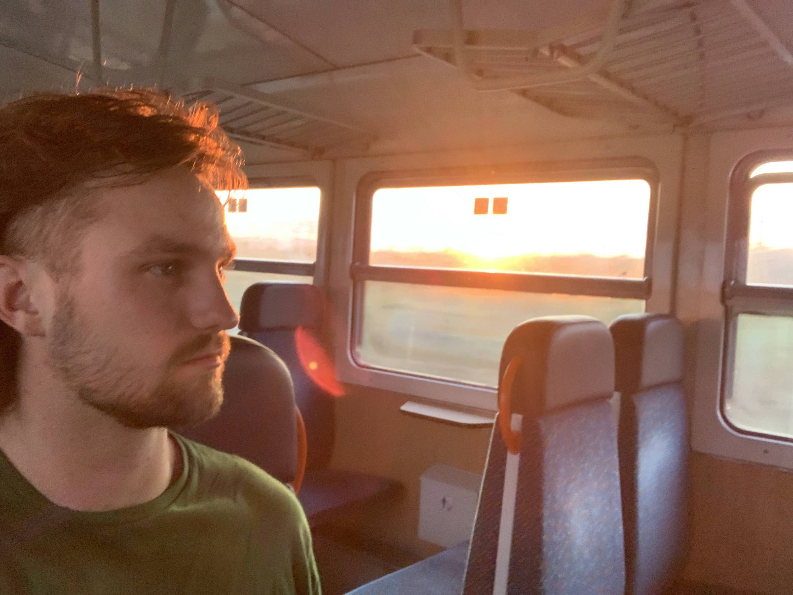
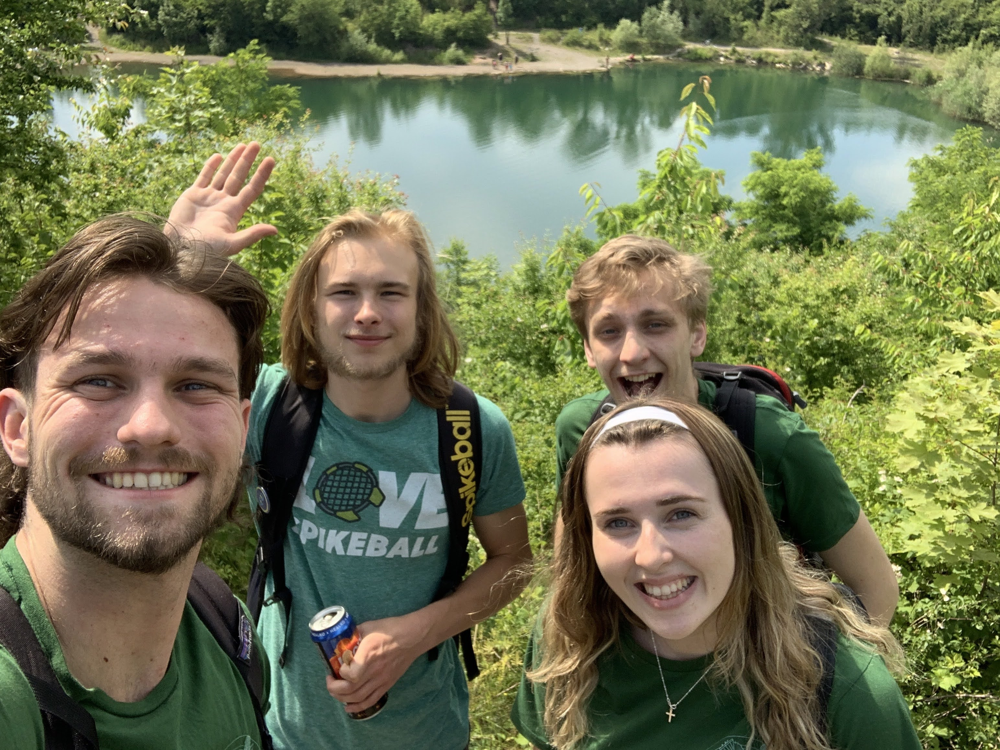
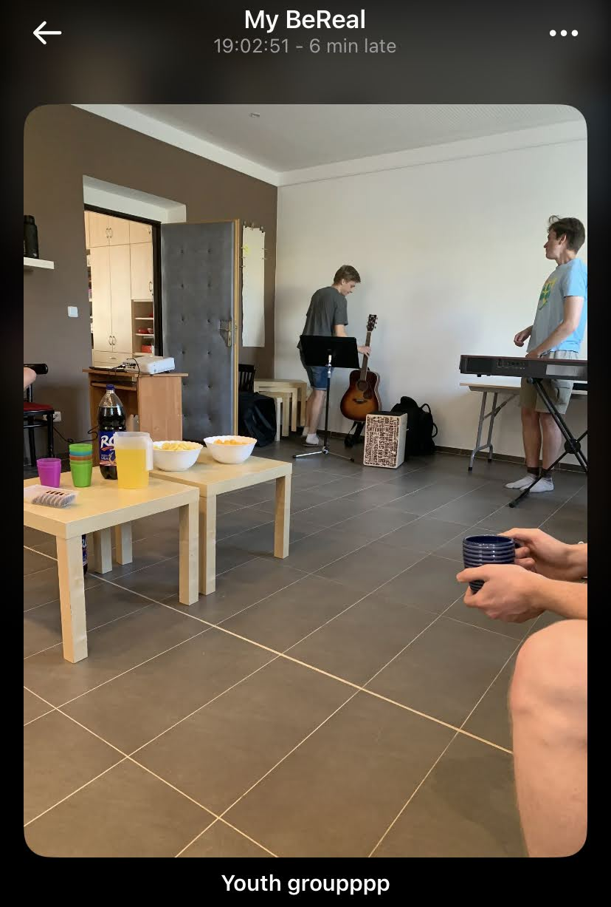
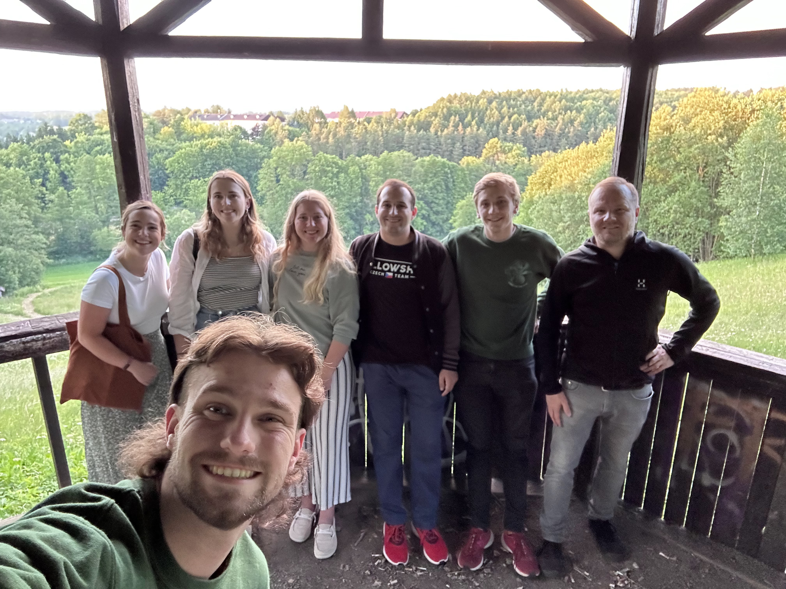
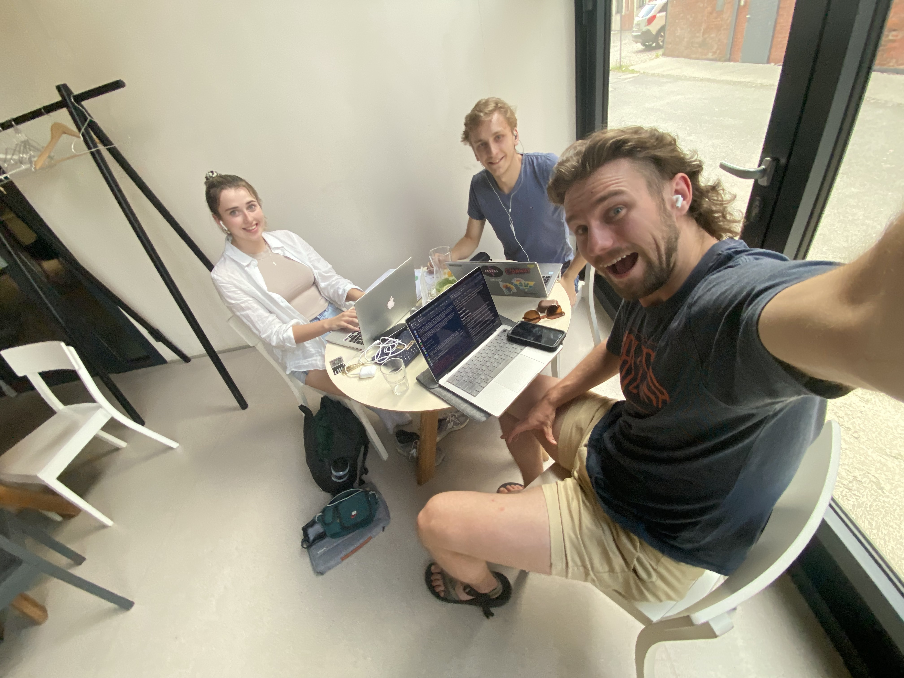

### Week Threeeeee

>"Father, make of me a crisis man. Bring those I contact to decision. Let me not be a milepost on a single road; make me a fork, that men must turn one way or another on facing Christ in me."[^1]

As I alluded in my last post, this week was full of travel! I think I have gone on 12 train rides in the past 7 days (Europe is kind of epic for having infrastructure like this). We three amigos (the Czech interns - or Czechterns hehe) met so many amazing people to touch base with before we do camp with all of them in a few weeks!

### How God is Moving in My Heart

I failed to mention this in the last post, but I got to work out with JV Edge Sports leader, [Casey Yorman](https://www.josiahventure.com/people-and-places/czech-republic/3868/) in his garage the previous two Mondays. During our last lift, he was gracious enough to ask me how I saw God meeting me during this time in Czechia. As a verbal processor, it was a prime opportunity to process what God was doing, and I'd love to share it with you here!

Coming into the internship, I was in the midst of a LOT of transition. Undergrad had just ended for me - many close friends were shot like arrows all over the world to do kingdom work. Realities I thought were going to be the case ended up not working out, and there was a lot of brokenness in the circumstances around me.

In that brokenness God met me and He reminded me that my suffering was a means to make me more whole. Through my emotional suffering, God helped me love Him more, drawing me to Himself. His love was the only thing I could certainly cling to. He proved to be my 'rock.'

God did more than remind me of His promises. When I sought the Lord, I was reminded of His heart for creation, and how He wants to restore it! He gave me a glimpse into His heart and enabled me to take on the same posture.

>And he who was seated on the throne said, “Behold, I am making all things new.” Also he said, “Write this down, for these words are trustworthy and true.”[^2]

Okay, so God not only reminded me of His promises and how He is making all things new, but also He **INVITES** me into that renewal process as a co-laborer. This is the highest honor, and my internship experience has made this so apparent.

### Říčany Visit

Říčany is a north suburb about 30 minutes north of Prague via train. We were able to go into the grammar school there, and promote English camp just as we did in Český Těšín. Students there were so lively - praise God! I was even asked several times, "You're an American, what are you doing in Říčany?" I love this question, because it gives me an opportunity to share the gospel. I even got to share why I am in Czechia in a school visit class!

We them met up with the pastor of their church, and met two of the youth group members which was very excited. We have fellowship over barbecue, which made me very excited to do camp with them (not because of the BBQ, in case you were wondering).

### Neratovice Visit

After the Říčany school visit, we were able to stay with the pastor of the Neratovice church (30 mins south of Prague), who was so hospitable! We had school visits the next day, and the students were very intrigued by the idea of English camp, because they haven't had one in their region for a long time (or ever?). 

We were asked by the pastor to lead the youth group that same night, because he and his family needed to attend a funeral. God knew what He was doing, because we decided to play some icebreaker games, worship together, and have a discussion on [Luke 15:1-7](https://www.bible.com/bible/59/LUK.15.ESV).

Two of the students (who are not believers) were attending the group for the first time, and they had told my fellow intern Lydia that at our group was the first time they had ever read the Bible. What an honor it was to introduce the students to Scripture for the first time!

### Bystre Visit

The next day we were able to go to youth group (in Czechia, youth group is called "mladez") for Petr's home church in Bystre where we will be doing our first camp. It was great to connect with the youth at that church, because we have a relational foundation to start with before we begin camp. 

We were treated with much kindness and hospitality at Bystre, and discussed ideas for the camp. Sunday in Bystre was also a joy, where we got to stand up in the service and share our excitement for camp. We invited the congregation to pray for camp, and for God to draw people to Himself. I'd love to invite you into the same thing!

### Prep for Camp

Upcoming we have a one-day JV-Czech (KAM) conference, followed by five more days to prepare for camp. I will be preparing devotionals, English camp materials, ice-breaker games, worship sets, and resting during this time! Camp season is intense, so please pray that our team can communicate, collaborate, and rest well during the camps. We want to be fresh to build relationships and lean into gospel conversation.

### Prayer Requests

I'd love if you joined us in our ministry by praying over us! Some things that we would love you to join us in petitioning the Lord for are:
- That the Lord may bring more students to English camps through our school visits.
- That God may continue to purify our hearts from day to day.
- That we as interns can integrate well into the various camp leadership teams and structures.
- For wisdom in navigating gospel conversations.
- For students to have an open heart toward the gospel.
- That we as interns may be effective in meeting students where they are at, to love on them.

Also, I have so many photos to share! I have had the problem of picking which ones to showcase on the blog, but I think I have found the solution. I'll pick some key ones to showcase on the page, but you can visit the album directly below:

##### [Click Here for Photo Dump!](https://photos.app.goo.gl/jCrYxjSyjxWEXDag6)

\
χάριτος καἰ εἰρήνη,\
(grace and peace)\
\
`- Carson`

[^1]: Jim Elliot
[^2]: Revelation 21:5 *ESV*