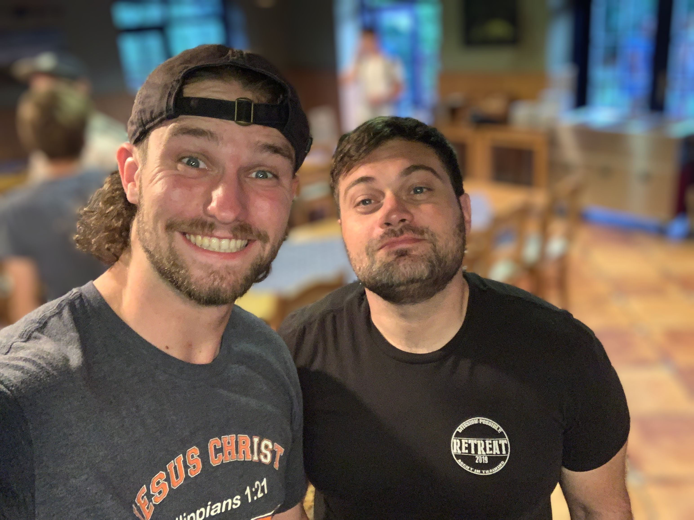
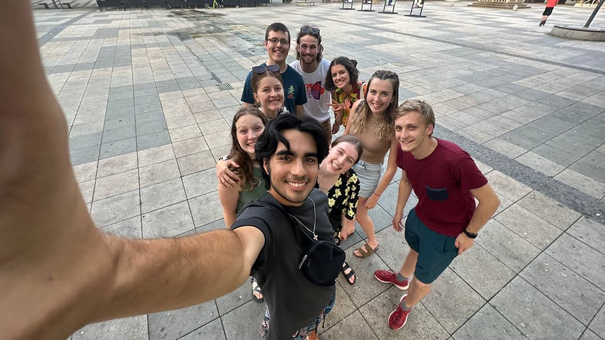
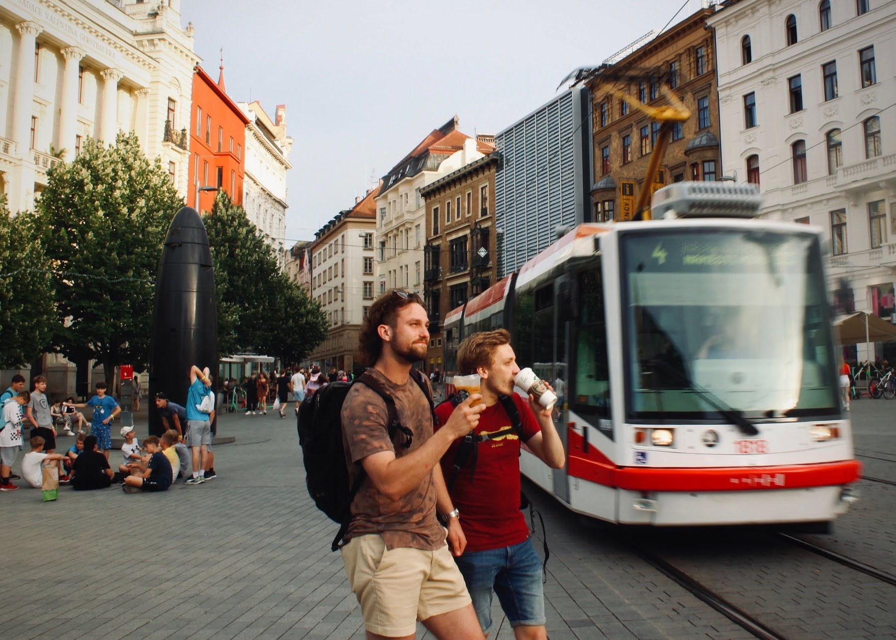
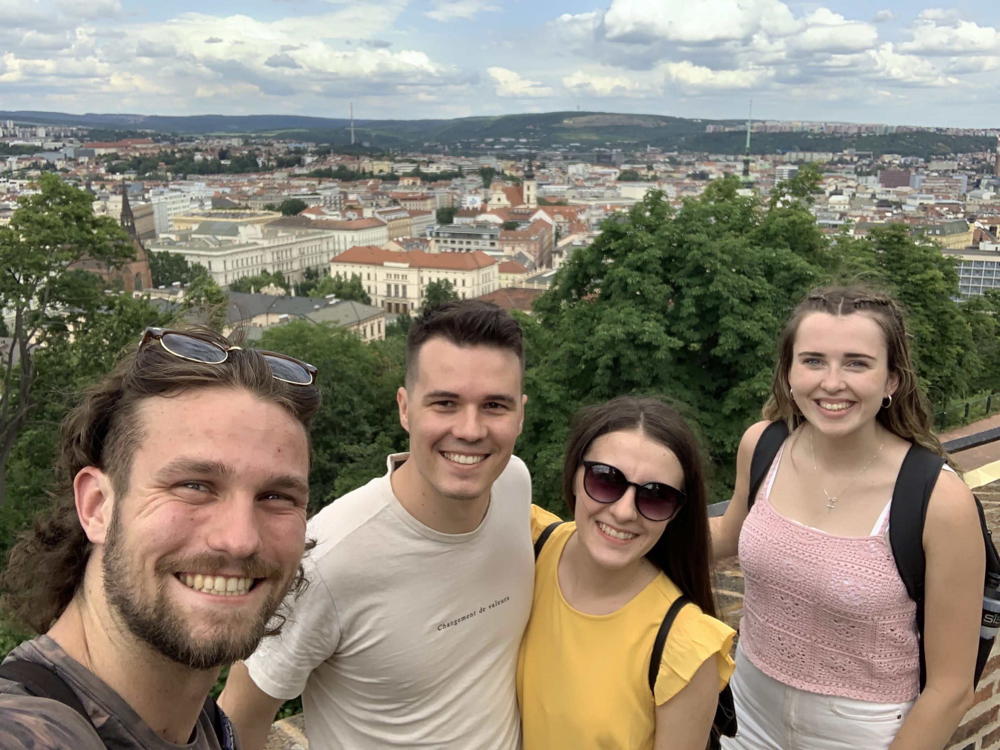
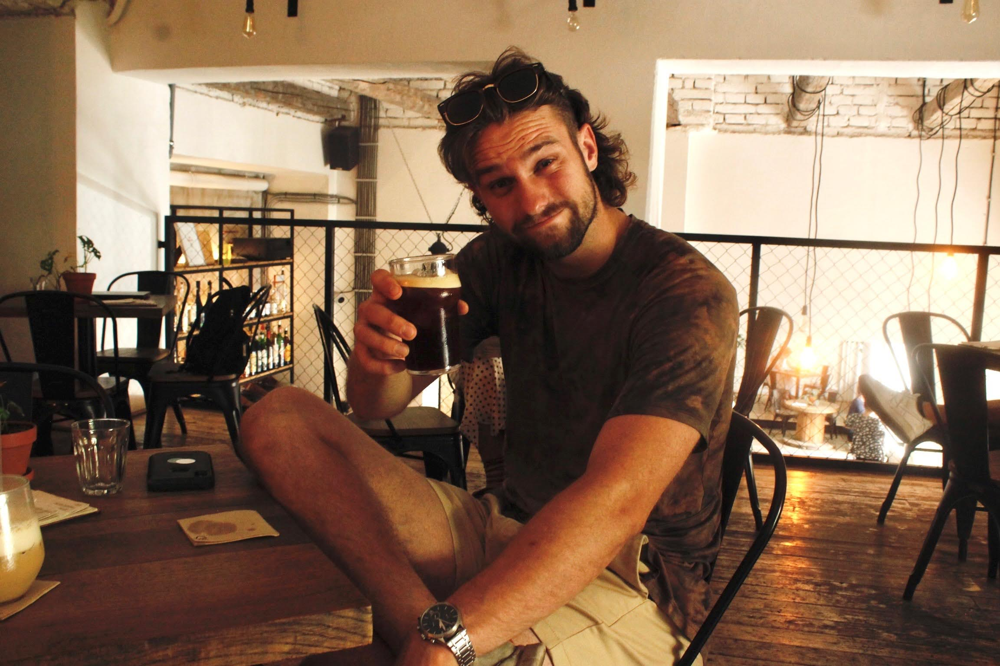

### Camp season is upon us!

As I write this, there are three mission teams en route to Krakow, Poland, where they will be greeted by JV missionaries who are ready to take them to their mission team training! As an intern, responsibilities at mission team training is a huge part of my job. I am so excited to get the ball rolling! Before we cover that, I should recap my week for you!

### Garden Party

Although I may be a Josiah Venture intern, I am actually working for an organization called KAM (Křesťanská Akademie Mladých - Christian Youth Academy), which is one of the many national organizations under Josiah Venture. For the past few summers, KAM has had a small get-together where all of the Czech national missionaries meet at the Josiah Venture conference center. This was actually a really refreshing experience for me, as I got to meet a TON of missionaries that serve here in Czechia, and I got to hear story after story of how God has moved in their lives. Although the gathering was only for an evening, I had so much fun!

Three people I really was excited to talk with were [Josh Dietz](https://www.josiahventure.com/people-and-places/czech-republic/4089), [Brad Kaspar](https://www.josiahventure.com/people-and-places/czech-republic/3759), and [Tomáš Zářický](https://www.josiahventure.com/people-and-places/czech-republic/6509).

Josh was my initial JV connection, so it is always good to see him and catch up. Brad Kaspar tapped me on the shoulder, seeing I was wearing a Wheaton shirt, and told me he was a class of '02 alumni! That was a really cool experience, and I got to hear his story and share mine with him. He moved to Czechia as a single missionary in 2005, and he continues to serve in regional work with his wife! Lastly, I met Tomáš Zářický at intern training, and he has been the biggest hype man. His energy is unmatched and so appreciated. I enjoyed getting to chat with him again and pray for him (he might be going to Ukraine to do camps later this summer)!

### One Last Time with C-Team

Being a Czechia intern for JV has its perks, and one of them is that we are close to all of the main Josiah Venture people. They all live here on the east side of Czechia! For most intern teams, they are the only ones in their countries, but we Czech camp interns have been able to bond with the JV communications interns!

Unfortunately, our last get-together happened this past week, because four of the six of them left on a long trip to visit JV camps all over Europe to create content and capture moments from the summer. We had such a good time with them though!

### Seen in Brno :eyes:

Our last off-day featured a trip to the second biggest city in Czechia: Brno! It was a great time, where I actually got to catch up with two people who were leaders at my first ever English Camp last summer!

### Český Těšín Visit

For church on Sunday, it was so great to visit the church who my home church partners with, CB Český Těšín! I got to see my home-stay visit family from last year, and I got to connect with lots of people who will be at our second English camp.

### Final Preparations

Camp is on the horizon, and from here on out, the summer is going to look a lot more fast-paced! As far as I know, we interns are ready for mission team training, and also for camp! I've been trying to get ahead in the work that I need to do, preparing devotionals and icebreaker games, but there is only so much we can do!

### Prayer Requests 

I'd love if you joined us in our ministry by praying over us! Some things that we would love you to join us in petitioning the Lord for are:
- For mission team training to serve its purpose in preparing the teams to do a long week and a half of camp ministry.
- That God may continue to purify our hearts from day to day.
- That we as interns can integrate well into the various camp leadership teams and structures.
- For strength, energy and focus during the fast-paced nature of our internship.
- For wisdom in navigating gospel conversations.
- For students to have an open heart toward the gospel.
- That we as interns may be effective in meeting students where they are at, to love on them.

Also, I have so many photos to share! I'll pick some key ones to showcase on the page, but you can visit the album directly below:

##### [Click Here for This Week's Photo Dump!](https://photos.app.goo.gl/rbhPhWNQptb4koSh6)

\
χάριτος καἰ εἰρήνη,\
(grace and peace)\
\
`- Carson`