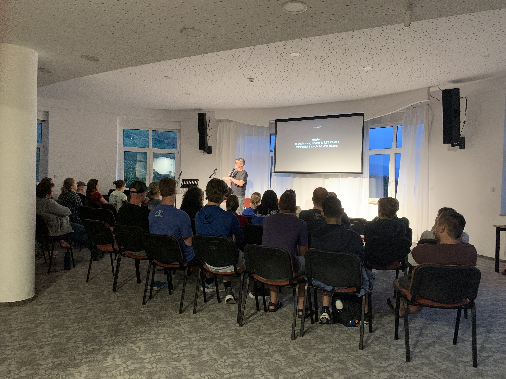
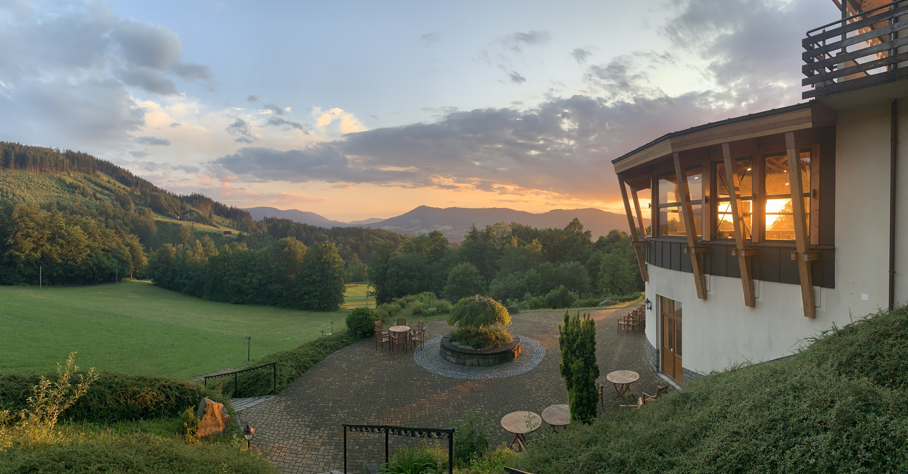
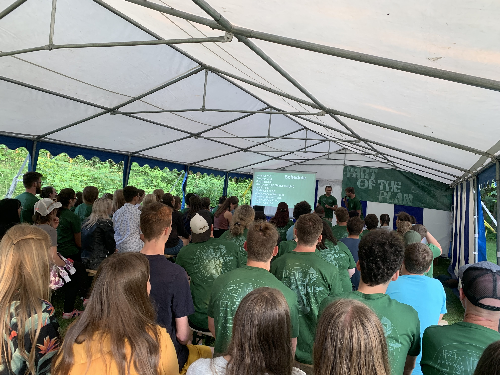
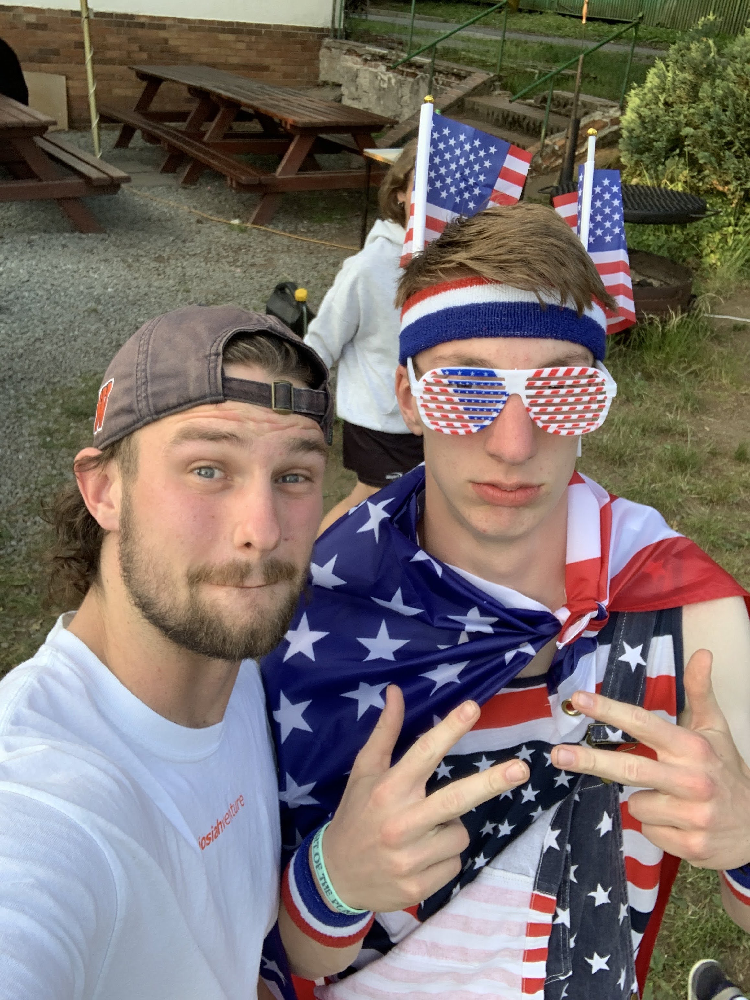
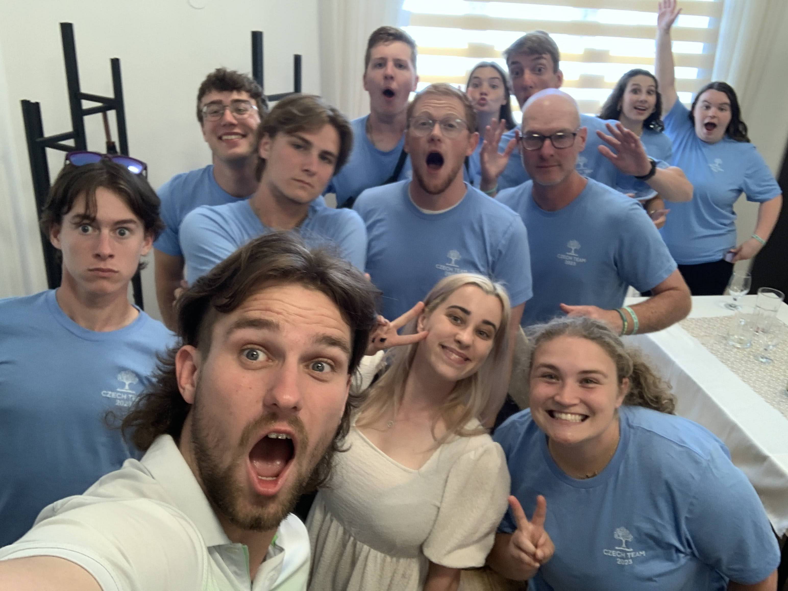

### Overview

Hey everyone! I am so tardy on this blog post and I apologize greatly. Thank you for your patience. These past two weeks have been phenomenal, and I have so much to unpack for you all. Hang tight for the sequence of events!

### Mission Team Training

June 27, we arrived back at Josiah Venture's training center near Frydlant, CZ at Malenovice. We were joined by four mission teams from different parts of the United States where they were given tips and 
protocol for how to do life well at camp. 

We taught them how to teach English well, lead discussion groups, understand Czech culture, and handle potential camp issues. Each day consisted of seminars, camp dance practice, workshops, free time, and the infamous evening program. 

For those who have never worked with Josiah Venture before, evening program is the climax of each day at camp, where there are high-energy songs, games, dances, skits, all building up to an evening talk with a gospel presentation. At mission team training, we put on our own evening program where we gave mission teams a glimpse into what each evening would look like for them at camp. As an intern, most of the things in evening program are my responsibility, minus the talk, so that was probably my most busiest time during training.

Overall mission team training was great because I was able to bond with the mission teams, especially the one I tagged along to do camp with.

### Arriving at Camp

June 30, we hopped on a train for 5 hours to where camp was, which was near the CB church in Bystre. For context, Bystre is in the northeast part of Bohemia, and so it is kind of in the center of the Czech Republic but more north. The American team typically arrives at camp a day or so before camp actually starts to set up the campground, and make final preparations. One of my responsibilities was to help make the [camp rules video](https://photos.app.goo.gl/TcDprFpt4qW8sTC2A). (You should watch it!) We ended up making a parody of a-ha's *Take on Me*. This video was played during the first evening program to highlight the do's and don't's of camp.

### Camp Highlights

#### [Watch the official camp recap video here!](https://www.youtube.com/watch?v=9g9W-Tql_Cs)

According to the Czech church people, this was the most students they had ever had for English camp! There were almost 70 students. Each day of camp, students could sign up for a morning activity, which could be either English class, a music workshop, a hike, or a sports activity. After lunch, there were different afternoon workshops containing games, useful skills, or talks. There was always an afternoon activity which involved team games, or water-activities, and evening program started after dinner. After each evening program, the whole camp split into discussion groups to process the content of the evening talk, and finally there was always a night time activity starting at 10pm.

For myself, I mostly led the morning sports workshops, but one morning I was asked to lead the music workshop! Of all the sports workshops, the Czechs seemed to enjoy the American sports the most (baseball and American football).

<video width="320" height="240" controls>
  <source src="baseball.mp4" type="video/mp4">
  <source src="movie.ogg" type="video/ogg">
Your browser does not support the video tag.
</video>

<video width="320" height="240" controls>
  <source src="football.mp4" type="video/mp4">
  <source src="movie.ogg" type="video/ogg">
Your browser does not support the video tag.
</video>

Afternoon workshops were a blast! From cooking workshops by a masterchef competitor, to a workshops on how to travel well, to crocheting, we offered a lot of different options for the students to gain random useful skills. One afternoon workshop I hosted was a specialty coffee workshop. The camp director had me and a local coffee barista come and teach people how to think about, buy, and brew specialty coffee! It was super cool and I actually learned a few new brewing methods from my Czech coffee counterpart, although I must say he was far more advanced than me.

<video width="640" height="480" controls>
  <source src="coffeetime.mp4" type="video/mp4">
  <source src="movie.ogg" type="video/ogg">
Your browser does not support the video tag.
</video>

This particular English camp really impressed me with all of the creativity that went into planning the afternoon activities, we did fun minigames, but we also had thematic games, such as the squid games (based off the Netflix series) and a game based off the 10 plagues of Egypt.

Evening programs were super energetic. The students I talked to all agreed that the camp dance was one of the most fun and energizing parts of camp. We also had the camp songs, led by yours truly and my fellow intern Lydia. Worship followed camp songs, which led up to each evening talk.

This year, the camp theme is "Part of the Plan," and all of the camp talks go through part of the redemptive arc of Scripture, starting in Genesis, and ending in the church age. Each evening, there is a different main topic, ranging from God's created design, to sin, to how God wants to restore hearts to follow Him. Each talk is followed by a discussion group time where students are given an opportunity to unpack what they thought about the talk.

God was moving all week, even in times when it did not seem clear to me! We had three of the eight girls in my discussion group give their lives to Jesus for the first time! Also in another group, a 13 year old boy who had been the quietest, most reserved kid at camp, gave his life to Jesus for the first time as well after our Labyrinth exhibition (series of interactive exhibitions that students walk through to process the gospel)! That next day he seemed like a completely different person. He was dancing - like everywhere. The joy was contagious. Also - it turns out that he started to speak - NEARLY FLUENT ENGLISH! He went from not talking at all to having full-fledged conversations with me. 

One more student came up to me at one of the evening activities where she shared with me that before camp, she was running away from God, even though her whole family are Christians. She told me that because of some important words from a few people, she wants to repent and turn. Please pray for her as she navigates this change of heart!

Evening activities created some of the most fun memories at camp. We had games, a talent show, a fourth of July party, and an Egypt party. Those were times where I felt like the strongest bonds were forged between the students and Americans.

### One More Story

Over the course of the week, I learned that one of the students in my room who was staying with me was very agnostic. I learned this after talking with him about books, because I had asked him one day during free time what he was reading. I loved this conversation because I promised to read one of his favorite books, and he promised to read *Mere Christianity* by C.S. Lewis.

Throughout the course of the week and at meal times, I would see him and continue to invest in the relationship, asking him questions about his life at university (he was an engineering student), and his hometown, and his hobbies.

I eventually learned that he has had a few open heart surgeries, with one being as recent as the past year. I asked him if the evening talks or discussion groups resonated with him, and he did not seem to think so. I proposed that perhaps it was a part of God's plan that he was at English camp. He did not seem to think so.

On the night of Labyrinth, I again got to chat with him for an hour! We talked about how he percieved the activity, and he seemed to be very respectful, even impressed by our belief in God, but he himself did not buy in because he was not sure anyone could know for sure. Then I asked him the following question:

**What do you think you would accept as evidence for God's existence?**

It turns out the question was something he had never considered before. Many people who do not believe in God do not realize that when they have no standard for evidence, they are in denial. They aren't giving God a chance.

The question had stumped him. The conversation lasted another thirty minutes, containing more questions, a retelling of the story of Jesus and the Samaritan woman at the well, and a promise to follow up on the conversation.

We followed up by continuing this conversation at breakfast on the last day of camp. This student's discussion group leader later told me that this conversation was one of the biggest takeaways he had at camp! He loved thinking about God, and although he never trusted Jesus, him and I are still in touch, and will be reading the books we promised each other we'd read! Please pray that God continues to work on this student's heart this summer!

### Praise God for the American Team

It was a joy to serve alongside the people at the Czech Church, CB Bystre, and also the American church, Fellowship Bible Church in Conway, AR. The team was young, energetic, and I am so excited to go visit them when I get back to the states! This camp would not have gone as well without them.

### Prayer

I would love to invite you to pray over this Josiah Venture camps ministry! Please pray for:

- the war in Ukraine to end promptly and for people there to begin rebuilding their lives and healing.

- the 9 remaining English camps happening across the Czech Republic this summer.

- the students who accepted Christ for the first time this past week at English Camp.

- safe travel for mission teams heading home, and heading to Czechia.

- Czech leaders to trust the Lord in their camps, and have all the logistical things run smoothly.

- the communities and churches hosting these English Camps, that they would be inviting places where new students would want to stay.

- For my energy levels as I am entering my second camps term.

### Photos

##### [Click Here for the Week 5 Photo Dump!](https://photos.app.goo.gl/HMacNDVtbjWUgVKK7)

##### [Click Here for the Week 6 Photo Dump!](https://photos.app.goo.gl/M67tmXBZDan9y8CB7)

Thank you for letting me invite you into what God is doing here in the Czech Republic!

\
χάριτος καἰ εἰρήνη,\
(grace and peace)\
\
`- Carson`