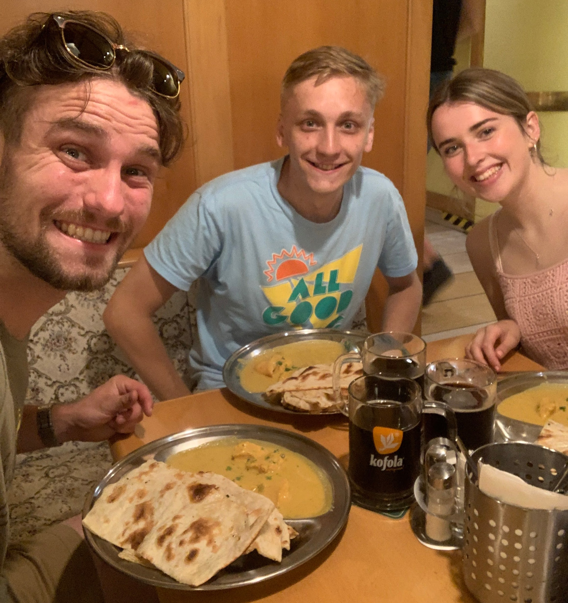
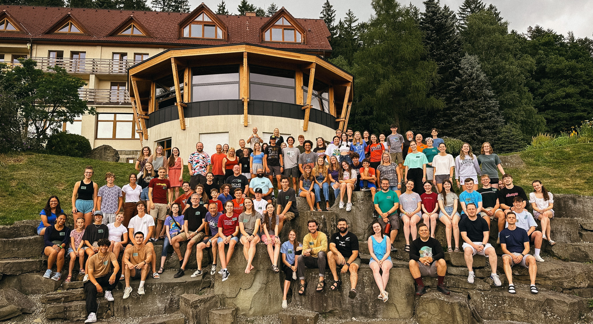
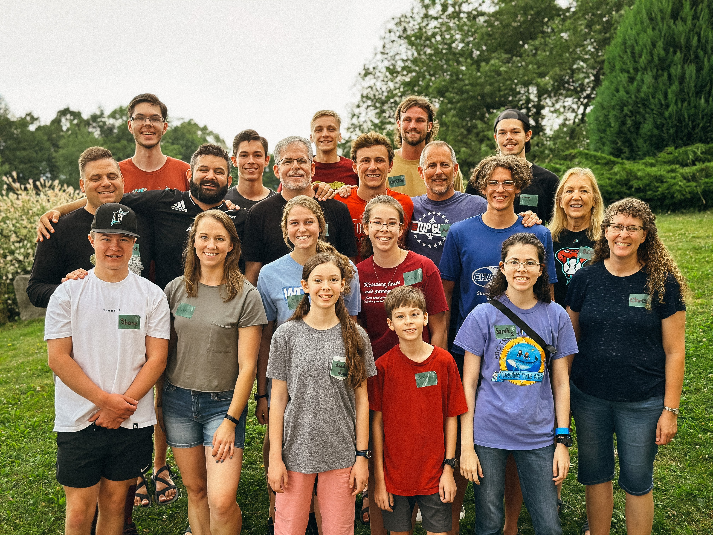
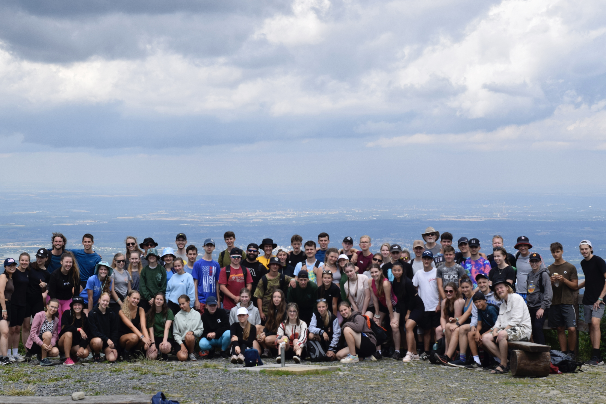
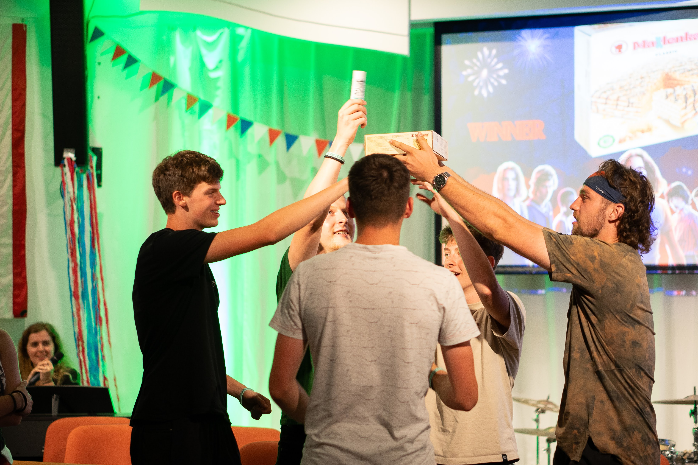
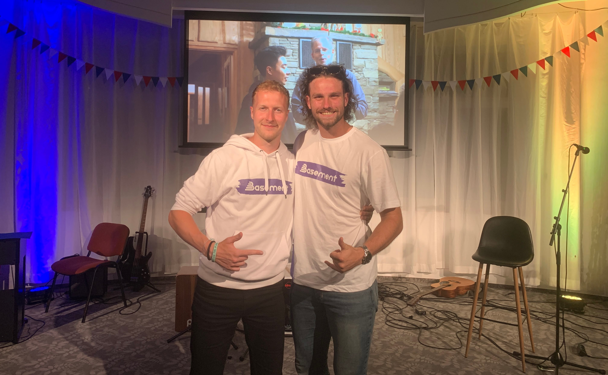
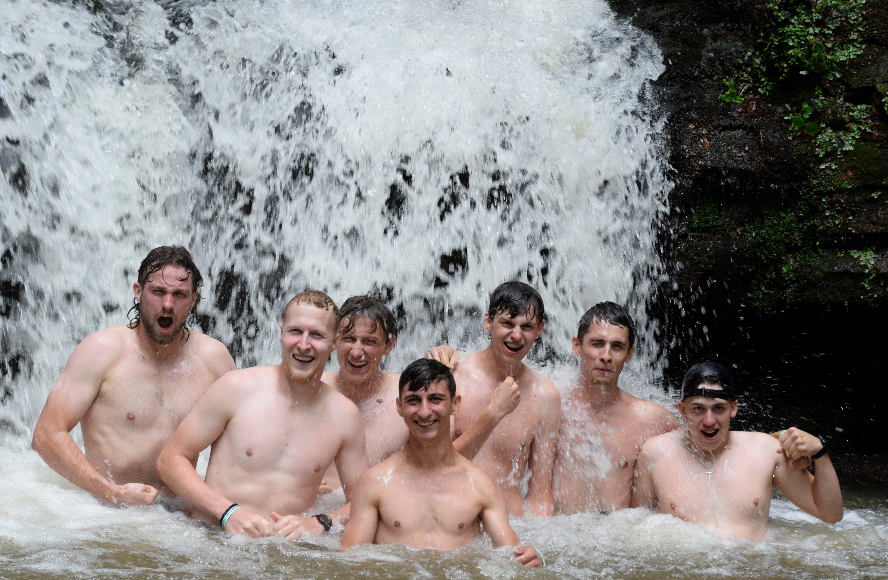

### Overview

...And then there was term two of camps! I am writing this on one of my off-days in Ostrava. From mission team training until now, I have been able to be a part of many special things, all of which are a part of God's Plan.

### Rest

Being a part of an English camp is such a rich, yet taxing experience... Being a part of three English camps is even more rich, yet taxing. So as interns, we spent an entire day just sleeping... Which was warranted, and then we crafted a tradition of hitting up a Nepalese restaurant before each camp!

### Mission Team Training

Mission team training was such a joy! This was our second session of the summer, so the good news is that there was not a lot that needed to be prepared ahead of time for this training. The other news is that for myself, mission team trainings have proved to be exhausting times. During these trainings, I generally have more responsibilities throughout the day, and for a lot of evening program I tend to be doing something (ranging from leading the camp dance, to doing skits and icebreakers). I had to learn how to steward my energy well during this time. Please pray for this next training this week, that I can steward my energy well! There needs to be a balance between conserving my energy for camp, and leaning into the mission teams to encourage them for their ministry.

### English Camp

This particular English Camp was special to me because of how familiar it was for me. It was also at the same place as mission team training, which was really convenient! This exact camp was the first Josiah Venture camp I was a part of last summer, and is one of the reasons I heavily considered doing this internship. Unlike the first camp, I was surrounded by not only people from my own home (the Family Bible Church American team), but also many of the campers had returned from last year's camp! Additionally, I noticed a few campers who had come from the school that I visited a few weeks ago in the same region.

  

  

  
  
  

Last camp was in the region of northeast Bohemia, but this camp is in a very unique region of the Czech Republic called Silesia. This particular region has a unique history because it has been fought over by Czechs, Austrians, and Poles for centuries. Currently, it is Czech, but many people speak Czech, Polish, and a language called Po našymu. It is a language that combines Czech, Slovakian, German and Polish. 

It was so good to serve alongside the familiar faces, and experience even a different culture within the Czech Republic. For some campers, I picked up right where I left off. For this camp, there were some students I knew were not believers, so it was good to talk to them about the gospel again to see how their attitudes had developed toward it after a year. Although these conversations were rich, many of these students still seemed hardened to it. I began to focus more on investing in relationships with the Czech leaders about halfway through the week, to empower and encourage them to continue to follow up with the non-yet-saved students after camp! Please pray for them as they continue in their ministry throughout the year!

  

  

  

  

### Spiritual Warfare

Both camps this summer have been filled with forthright spiritual warfare. Satan for whatever reason is not trying to hide what he is doing. This particular camp was difficult for the leadership team due to constant news of health issues for close friends and family. Though this blog is not the place to share all of the details, there were a few prayer sessions throughout the week that we as a team were able to have. It was amazing to see God providing peace to those affected! In retrospect, these were not distractions but opportunities to trust in the Lord in the midst of our service!

### Epické Vzpomínky (Epic Memories)

This camp was so fun to be a part of for a second time! My discussion group was full of students from the church, so it was good to challenge them with slightly deeper questions about the evening talks. We even came up with a group name, called "the freezer," as we claimed to be the "coolest" discussion group.

Additionally, there were so many fun things we partook in - a hike to summit the tallest mountain in the region, a water day, a waterfall hike, many sports and English classes, a functional fitness workshop led by yours truly, a head-to-head soccer game with another English camp, and more!

One thing to keep in mind is that this ministry is one part of a church's annual ministry. For that reason, I see it as an extremely valueable outreach event for students in their community. Not only is it a place where students can hear the gospel for the first time, but it is also a place where students who have never been connected with the mládež (youth group) can build relationships with those who are a part of the church.

Overall, it was amazing to see God moving in the hearts of the students who had come for the first time. If I had to pick a highlight, it would either be that or reconnecting with some of the student leaders from the CB church in Český Těšín.

### Photo Dump

You're probably wondering why I even had a photo dump, considering how many were in this blog post, but alas, here it is!

[Camp Photo Dump](https://photos.app.goo.gl/D8dN6YSLuK7bgRwM7)

[Weeks 7 & 8 Photo Dump](https://photos.app.goo.gl/rUww41QAtDQGtPkH8)

### Prayer Requests

Here are some prayer requests!

- My energy levels are running low, and I would love prayer for energy.
- Please pray for an ability to continue to love students as Christ would.
- Please pray for there to be easy opportunities to engage the word of God in this next term!
- Please pray for the students attending the next camp who have never heard the gospel.
- This camp is being put on by a church who has never done an English camp! Pray for the church and the Czech team helping us put on the camp!
- There are a few more mission teams coming for three more camps in the Czech Republic this summer! Pray for these churches and their mission teams.
- Pray for my fellow Josiah Venture team, as we all still have any responsibilities for the rest of the summer.
- Pray for me as I will be giving some camp talks at the next camp! Pray for the gospel to be faithfully preached!
- Pray for me also as I will be preaching at the church in Neratovice (north of Prague) on August 6!

Thank you for supporting my ministry through your interest and prayer! Let me know if there are things you need prayer for so I can stay involved in your lives!

\
χάριτος καἰ εἰρήνη,\
(grace and peace)\
\
`- Carson`