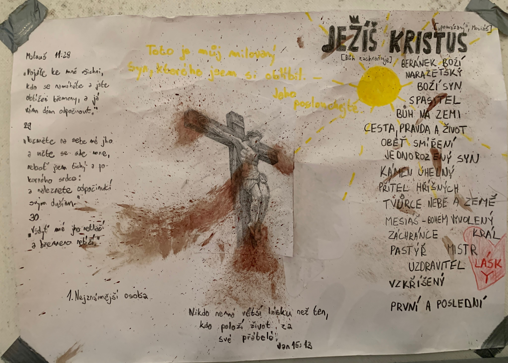

Greetings! I am so thankful for all of you. I am writing this blog post (as well as every subsequent post) from Waco, Texas. I finished my internship with [Josiah Venture](https://www.josiahventure.com) on August 10, but have since flown to Phoenix, packed up everything I own and moved to Waco, and visited some friends in Arkansas who I met at my first English Camp this summer! So if this update feels far removed from the prior, it is because there has been a lot of time since my last post. Thanks for your thoughts and prayers, and stay tuned as I unpack more of my summer for you!

### **Important Announcement**

I am hosting a Zoom call on Saturday, September 2, 2023 at **7AM Pacific Standard Time**. This is an opportunity to hear it from me about what the summer was like. In this call I'll give a short presentation, followed by a Q&A. There might be an appearance from my fellow interns Lydia Hanilton (Ireland) and Petr Cvejn (Czech)!

Join the meeting [here](https://baylor.zoom.us/j/3798247698?pwd=VzJ0YlA2UDNTUDhLaFpTalpQRm1tdz09) or click [here](https://docs.google.com/document/d/1PEV3TJj_cjoRMTyudIOAReSNqeYKVkd1CdZUMCesKEg/edit?usp=sharing) to see invite details in a Google Doc. The password is **436782**.

  

  
  
  

### Mission Team Training

Since you've last heard from me, there has been a lot of things that have conspired. One of those bitter-sweet things has been our final mission team training of the summer! We were situated at a hotel north of Prague for a few days, where we hosted two churches and their mission teams preparing them for English camp. One of the most fun parts of this internship has been meeting people from all over the U.S. who partnered with Josiah Venture and came to mission team training.

### Camp with the Churches

These churches were hosting their first ever English camp ever! This made camp a vastly different experience than the prior two camps, where the churches we partnered with had been doing English camps for at least 7 years. Rather than joining this church in ministry, it felt at points we were inviting them into the ministry with the way we were doing things while showing the young believers how things at camp work. I say that it felt this way but in actuality, they were truly inviting us into ministry in their community.

#### Relationships

One could say this symbiotic dynamic was refreshing, but honestly the biggest challenge I faced at camp was maintaining high energy levels to be present in every moment. It was truly an opportunity to entrust to the Lord the relationships I was forming. My personal bandwidth was approaching its limit throughout the week.

  

  

  
  
  

Regardless, this camp was so fun! It was my first week this whole summer that I taught English and it was so much more fun than I remember it being! Members of my class at the end of camp told one of the missionaries we were with that it was a highlight of camp!

I had the privilege of hanging out with students who had been displaced by the war in Ukraine at this camp, and it was remarkable to try to model Christ for them in the week that I had! We connected over small things, like high fives, Fortnite dances, and games at camp. For those students, their Czech was amazing, but their English was very poor (one of them told me they learned Czech in just five months - crazy!).

Two particular students I was really encouraged by were the students who were the Czech believers (names obfuscated for confidentiality). James was 18 years old, and one of the first questions he asked me thirty minutes into our relationship was my take on why bad things happen to good people. It was a fruitful conversation, and it basically set the tone for our relationship the whole week. Beyond intense questions discussed, we built on similar senses of humor, and I was able to empower him to investigate his big questions and use resources at his fingertips.

Another one I was encouraged by was Riley, who was actually an older camper who had a hunger for Christian community. He was an amazing athlete who was creating culture in his community through spikeball. I am thankful for connecting with him and excited to see how God uses his giftings in the future.

  
  
  

#### How I Saw God Moving

Overall, this camp is definitely a situation where I will not see fruit borne until years in the future, but the fact that I was able to join this church and train them on how to do a Josiah Venture English camp was an amazing opportunity and a huge honor. This camp was particularly difficult to navigate spiritually, as many students were not believers. We were trying to love them as Christ would, and part of that was leaning into opportunities to share the gospel with them at evening program. At this camp I was able to give a camp talk about who Jesus is, and also share my testimony the last full day of camp.

Sometimes you share the gospel and people's hearts are softened, and other times their hearts are calloused. This camp definitely felt like there were a lot more students in the latter circumstance, but it was interesting because they loved our staff as people. Though students were not agreeable to the gospel, we were able to love them as Christ loved us throughout the week.

### Church at Řicany

After camp I was able to stay in the home of one of the families from the church in Řicany, where I was also able to preach on Sunday! Check out the outline of my sermon [here](https://drive.google.com/file/d/1C_zF6V7uSZlBvjKsfysQvfdvDIQA9vNH/view?usp=sharing).

Praise God, because a lot of the people shared with me that the word preached that morning was very impactful for them, especially the younger people in the church. It was a cool opportunity for God to move.

### Conclusion

Overall, this camp was by far the most taxing camp all summer, because of the responsibilities that fell on me, but it was also so rewarding! Praise God I was able to be a part of it and I want to invite you to join me in praying for next year's English camp, and for Josiah Venture to send a short term mission team to support these churches next year. Thanks for keeping up with the blog and stay tuned for the next post about the last few days of my internship!

\
χάριτος καἰ εἰρήνη,\
(grace and peace)\
\
`- Carson`

